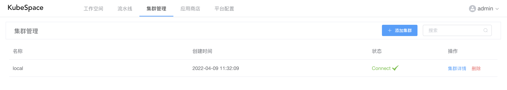
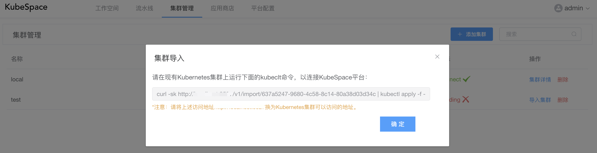
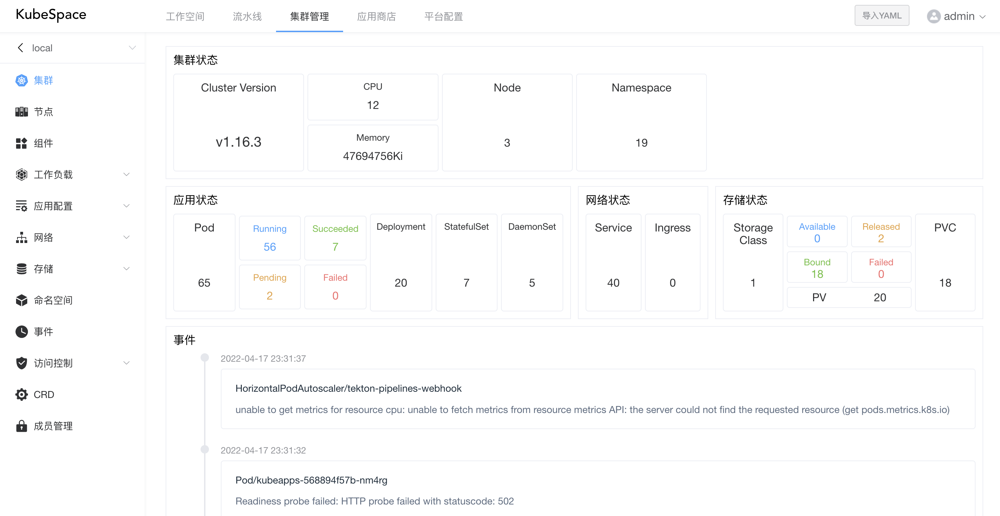
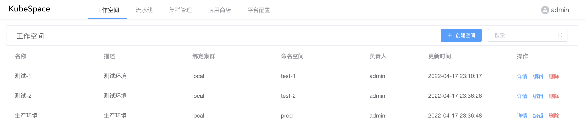
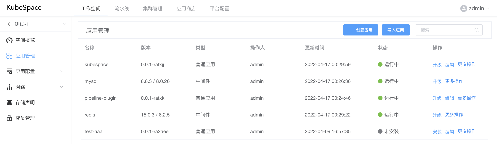
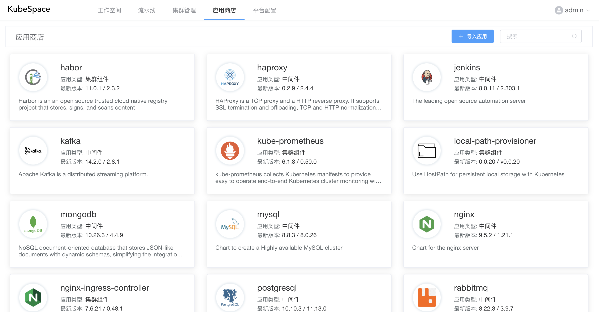
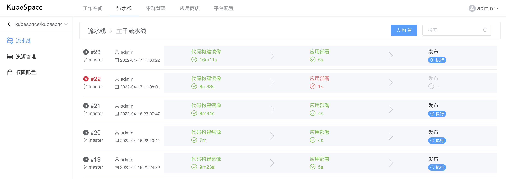

# KubeSpace

KubeSpace是一个DevOps以及Kubernetes多集群管理平台。KubeSpace可以兼容不同云厂商的Kubernetes集群，极大的方便了集群的管理工作。

KubeSpace平台当前包括如下功能：

1. 集群管理：Kubernetes集群原生资源的管理；
2. 工作空间：以环境（测试、生产等）以及应用为视角的工作空间管理；
3. 流水线：通过多种任务插件支持CICD，快速发布代码并部署到不同的工作空间；
4. 应用商店：内置丰富的中间件（mysql、redis等），以及支持导入发布自定义应用；
5. 平台配置：密钥、镜像仓库管理，以及不同模块的权限管理。

### 安装

通过[helm](https://helm.sh/docs/intro/install/)安装kubespace，执行如下命令：
```
helm repo add kubespace https://kubespace.cn/charts
kubectl create namespace kubespace
helm install kubespace -n kubespace kubespace/kubespace
```

安装之后，查看所有Pod是否运行正常：
```
kubectl get pods -n kubespace -owide -w
```

当所有Pod运行正常后，通过如下命令查看浏览器访问地址：
```
export NODE_PORT=$(kubectl get -n kubespace -o jsonpath="{.spec.ports[0].nodePort}" services kubespace)
export NODE_IP=$(kubectl get nodes -o jsonpath="{.items[0].status.addresses[0].address}")
echo http://$NODE_IP:$NODE_PORT
```

### 使用说明

#### 1. 首次登录

在KubeSpace第一次登录时，会要求输入admin超级管理员的密码，然后以admin帐号登录。


#### 2. 导入集群

首次登录之后，默认会将当前集群添加到平台。



您还可以添加其它集群到平台，点击「添加集群」，输入集群名称，集群添加之后，会提示将Kubernetes集群导入连接到KubeSpace平台。



在Kubernetes集群中使用上述的kubectl命令部署agent服务，将集群连接导入到KubeSpace平台。

等待几分钟后，查看agent服务是否启动。

> kubectl get pods -n kubespace


可以看到agent服务的pod已经是Running状态，在KubeSpace平台可以看到集群状态为Connect。

#### 3. 集群管理

将Kubernetes集群成功连接导入到KubeSpace平台之后，就可以统一管理集群中的资源了。



#### 4. 工作空间

在工作空间，可以创建多个环境，绑定不同集群的namespace，来隔离应用以及资源。



在每个空间中，可以创建应用或导入应用商店中的应用，并进行安装/升级。



#### 5. 应用商店

KubeSpace平台内置了丰富的中间件，可以快速导入到工作空间，并安装使用。同时也可以导入/发布自己的应用到应用商店。



#### 6. 流水线

在流水线中，可以配置多种任务插件，来快速构建代码并部署到工作空间中。



### 交流讨论

如果您在使用过程中，有任何问题、建议或功能需求，可以随时在[issues](https://github.com/kubespace/kubespace/issues)中提交请求，我们会及时跟进。

### License
Copyright 2020 KubeSpace.

Licensed under the Apache License, Version 2.0 (the "License"); you may not use this file except in compliance with the License. You may obtain a copy of the License at

http://www.apache.org/licenses/LICENSE-2.0

Unless required by applicable law or agreed to in writing, software distributed under the License is distributed on an "AS IS" BASIS, WITHOUT WARRANTIES OR CONDITIONS OF ANY KIND, either express or implied. See the License for the specific language governing permissions and limitations under the License.